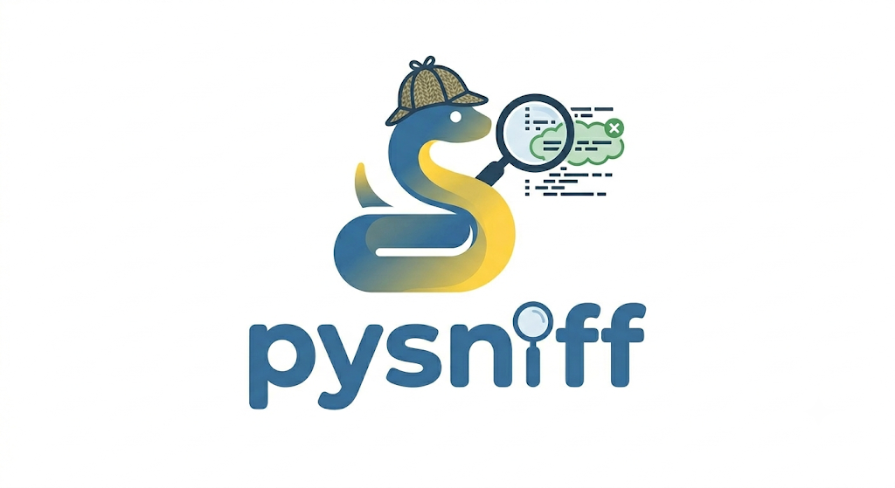

*Versão em português: [README.pt-BR.md](README.pt-BR.md)*

# PySniff: code smell detection and refactoring dataset construction for Python

PySniff is a command line tool that detects five code smells in Python through static
analysis, built on top of a repository mining pipeline that extracts real before/after
refactoring pairs from GitHub commit history.

Course project for Software Engineering II at UFMG, developed by Gustavo Dias Apolinário,
Bernardo Vale dos Santos Bento and Filipe Mauro da Terra Caldeira.

## The main finding

Mining refactoring pairs from commit history has a yield problem, and the yield is not uniform
across smells. Using keyword search over commit messages, it tracks **how objectively the smell can
be defined**:

| Smell | Yield | Why |
|---|---|---|
| Dead Code | 38% | binary: the code is gone or it is not |
| Long Method | 19% | semi-objective: a numeric threshold on length |
| Deep Nesting | 4% | structural but contextual |
| Long Parameter List | 3% | "long" is a judgement call |
| Magic Numbers | 1.2% (n = 1,376) | "magic" depends on the domain |

Five out of five points fall in the predicted order, monotonically decreasing.

**But subjectivity turns out not to be destiny.** Anchoring the search on a linter **rule identifier**
instead of on commit-message wording, and filtering the diff for the structural change that the
refactoring implies, restores the yield of the subjective smells:

| Smell | Keyword mining | Rule-ID anchoring |
|---|---|---|
| Long Parameter List | 3% | **77%** |
| Magic Numbers | 1.2% | **19%** |
| Deep Nesting | 4% | **12%** |
| Long Method | 19% | **42%** |

Measured over a single batch of 672 judged candidates, of which 180 were real.

The reading matters more than the numbers. What is subjective is the *natural language* people use
to describe a change in a commit message. The change itself is often perfectly objective, and a
linter rule already encodes that objectivity. Mining against the rule rather than against the prose
converts a subjective criterion into a mineable one.

The honest note that goes with it: the initial pilot for Dead Code reported 60% and the full batch
came in at 38%, because the first sample was not representative. The qualitative pattern held, the
number did not.

## Keeping the dataset honest

Four decisions, each guarding against a specific way this kind of dataset goes wrong.

**Roles are separated across model families.** The judge is Gemma and it only ever evaluates, never
generates. Generation for two of the tiers uses different families. The fine-tuning target was
**changed** from Qwen2.5-Coder to Stable Code Instruct precisely because the original target shared
a family with one of the generators, which is a path to a model grading its own dialect.

**Residual circularity is acknowledged rather than hidden.** The structural AST signal used in one
tier's prompt was chosen specifically so the criteria would not come from the judge's own prose.

**The oracles never touch training data.** PyRef acts as a deterministic validator producing ground
truth, and Sourcery is the comparison baseline that the trained model has to match or beat. A tool
cannot be both the teacher and the exam.

**The split is by repository, not by example.** Train and test never share a repository, with
assertions enforcing it, so a model cannot memorise one project's idioms and score well on itself.

**Quality was measured before training, deliberately.** A stratified sample of 50 pairs was audited
blind to the AST proxy, with population precision reweighted by base rate and agreement measured by
Cohen's kappa, followed by an LLM-assisted re-audit. Measuring data quality after training the model
tells you nothing you can act on.

## An evaluation metric that was rejected

CodeBLEU was discarded on purpose: it penalises a refactoring that is correct but different from the
reference, which is the normal case. Evaluation instead uses smell resolution as the primary metric,
plus behaviour preservation and non-introduction of new smells.

## A line that was tested and abandoned

Mining pull requests from four large projects was piloted and dropped. Only one of the four carried
usable signal, and the empirical result is recorded rather than the idea being quietly forgotten.

## The five smells

| ID | Smell | Target refactoring | Detection criterion |
|---|---|---|---|
| R1 | Long Method | Extract Method | Lizard, NLOC above 30 or cyclomatic complexity above 10 |
| R2 | Long Parameter List | Parameter Object | AST parameter count above 5 |
| R3 | Magic Numbers | Named Constant | AST walk with a whitelist of structural literals |
| R4 | Deep Nesting | Guard Clauses | AST depth above 3 |
| R5 | Dead Code | Removal | AST analysis for unreachable code and dead stores |

Every detector implements the same contract, `detect(fn: FunctionInfo) -> DetectionResult`,
in `detectores/`.

## Scope, stated plainly

The original proposal promised 12 smells and 11 LoRA adapters. What was built and documented
is 5 smells with rule based detection, plus a fine tuning track conditioned on the measured
quality of the dataset. The reduction is recorded with its reasoning in
`docs/DECISOES_PROJETO.md` rather than quietly dropped.

The refactoring model itself has not been trained. Its infrastructure lives in `trilha_b/`,
targeting Stable Code Instruct 3B with QLoRA.

## Installing

Requires Python 3.11 or later. Continuous integration runs the suite on Python 3.13 across
Linux, macOS and Windows.

```bash
git clone https://github.com/Gronoxx/PySniff
cd PySniff
python3 -m venv .venv
source .venv/bin/activate
pip install -r requirements_cli.txt
```

For the detection CLI alone, without the mining pipeline, the minimum is
`pip install lizard click rich`.

## Using it

```bash
python3 cli.py smells                          # list the five supported smells
python3 cli.py scan path/to/project/           # scan a file or directory
python3 cli.py scan src/ --smell R1            # restrict to specific smells
python3 cli.py scan src/ --json > result.json  # structured output
python3 cli.py scan src/ --fail-on-detect      # exit code 1 when a smell is found, for CI
```

Exit codes for `scan`: 0 when analysis completes, 1 when `--fail-on-detect` is set and
something was detected, 2 when no Python file was found.

## Tests

```bash
pip install -r requirements_cli.txt -r requirements-dev.txt
python3 -m pytest
python3 -m pytest --cov
```

Over 250 tests covering detectors, the CLI and the mining pipeline, run on every push and
pull request through GitHub Actions.

## Built with

Click and Rich for the command line. The standard library `ast` module, Lizard, Pylint, Ruff
and Vulture for static analysis. PyDriller, GitPython and PyGithub for mining, with Seart GHS
for repository selection. Gemma as a local LLM judge. pytest and GitHub Actions for testing.
HuggingFace Transformers and PEFT for the fine tuning track.

## Repository layout

The project spans three repositories, separated by role.

| Repository | Role | Visibility |
|---|---|---|
| `PySniff` (this one) | mining, detectors, CLI, training track | public |
| `PySniff-anotador` | web annotation tool, codebook and probe scorer | public |
| `PySniff-dataset` | mined candidates, verdicts, annotations, quality probe | private |

Inside this repository, `cli.py` holds the detection interface, `detectores/` the five static
detectors, `extracao/` the mining pipeline, `core/` shared types and the evaluation oracle,
`trilha_b/` the fine tuning configuration, and `docs/` the dated design decisions.
